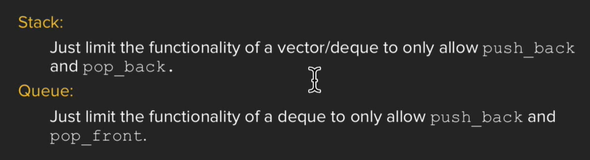

# Containers

the power of STL

```cpp
vector<int> vec(kNumInts);
std::generate(vec.begin(), vec.end(), rand);
std::sort(vec.begin(), vec.end());
std::copy(vec.begin(), vec.end(), std::ostream_iterator<int>(cout, "\n"));
return 0;
```

## Sequence Containers

```cpp
std::vector<T>
std::array<T>
std::deque<T>
std::list<T>
std::forward_list<T>
```

### vector and deque

```cpp
// vector's key difference with basic array
// is that vector has at(),which will have bounds check
vector<int> vec(15,5); // a vector with 15 elements,all assigned as 5
cout << vec.at(20); // will throw an error
cout << vec[20]; // still work
// however, this is not set as default
// because if u can write correctly, the boundary check will just slow down the speed
// this is opposed to cpp's philosophy 

// vector has another disadvantage
// its push_front func executes slowly
// deque is more suitable for this job(double ended queue)
// its push_back/pop_back/push_front/pop_front are faster(especially *_front are faster than vector)
deque<int> deq;
deq.push_front(1); // faster than vec.push_front(1);

// whereas, it's still recommended to use vector by default,as its common operations like element access are faster than deque.
```

## Container adaptors

```cpp
std::stack<T, Container>
std::queue<T, Container>
std::priority_queue<T, Container, Compare>
```



### adaptor

a wrapper to the underlying container
and same Modifiers with vector or deque

## Associative Containers

```cpp
std::set<T, Compare, Allocator> // default by '<'
std::map<Key, T, Compare, Allocator>
std::multiset<T, Compare, Allocator>
std::multimap<Key, T, Compare, Allocator>
```

### myMap[index] 与 myMap.at(index) 的区别

if have no word in keys
frequencyMap[word] // automatically create an entry and default initialize it,0

frequencyMap.at(word) // if word not exist throw a exception

check the key in the Map
frequencyMap.count(word)

## iterator

std::sort(vec.begin(),vec.end());

auto result_it = std::find(set.begin(),set.end(),ELEM_TO_FIND);
if(result_it==set.end())

### 5 different types of iterators

Input Iterators.(can only access elements)
Output Iterators.(can only assign elements)
Forward Iterator.(input & output, but can only move in the forward direction)
Bidirectional Iterators.(Forward, and can also move backwards)
Random-Access Iterators.(move randomly like pointers)

think about pointers as a sort of a specific class
iterator : a set of promises

## Advanced Containers

the same key has multiple values

```cpp
// usage of find
// we can also use the find algorithm to look for an element
// in a collection and return an iterator to it
vector<int>::iterator it = std::find(vec.begin(), vec.end(), 5);
if(it != vec.end()) {
    cout << "Found elem " << *it << endl;
} else {
    cout << "Element not found " << endl;
}
// find is slightly faster than count(count is based on find)

// another words,the find in string is a little bit different
    std::string s = "hell[o";
if (s.find('[') != std::string::npos)
    ; // found
else
    ; // not found
    
// after c++23,the string supports contains() to find
// it will return a boolean
s.contains("hello");
s.contains('h');
    
// upper_bound versus inner_bound
    
set<int> mySet{4,1,3,5,55,5, 9, 22, 19, 28};

// we can iterate through a range of elements in
// a sorted collection
    
// (sort first!)
// .lower_bound(value) (the first value >= value)
// .upper_bound(value) (the first value > value)
// below code means [7,28]
set<int>::iterator iter = mySet.lower_bound(7);
set<int>::iterator end = mySet.upper_bound(28);
    
// map<string,int> -> pair<string,int>
// pair.first
// pair.second 
// when using map iterators, notice the brackets
// e.g. (*i).first
// notice the parentheses
```
